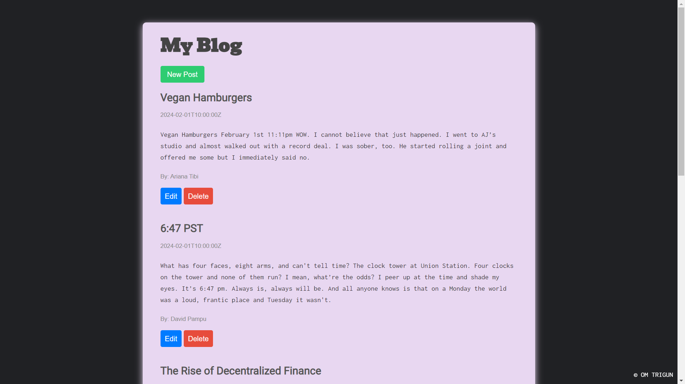

# **BlogPost Web App**

A simple web application for managing blog posts using Node.js, EJS, and an in-memory data store.


## Features

- **Get All Posts:** Retrieve a list of all blog posts.

- **Get Specific Post:** Fetch a specific blog post by providing its ID.
- **Create New Post:** Add a new blog post.
- **Update Post:** Modify a post by updating one of its parameters.
- **Delete Post:** Remove a specific blog post using its ID.


## Tech Stack

**Client:** EJS, CSS, JavaScript

**Server:** Node, Express


## Run Locally

Clone the project

```bash
  git clone https://github.com/trigunom/BlogPOST-API.git
```

Go to the project directory

```bash
  cd my-project
```

Install dependencies

```bash
  npm install
```
Open two terminals :

1.Start the index server at http://localhost:4000

```bash
  node index.js
```
2.Start the main server at http://localhost:3000

```bash
  node server.js
```


## Usage/Examples

Access the web app in your browser at http://localhost:3000.
Explore different endpoints to interact with the blog posts.

## How to interact

- Use a tool like Postman or CURL for API testing.

- Visit the provided URLs in your browser to access the UI.
## API Reference

#### Get all posts

```http
  GET /posts
```


#### Get specific post

```http
  GET /posts/:id
```

#### Create a new post

```http
  POST /posts
```

| Key       | Value     | Description                       |
| :-------- | :------- | :-------------------------------- |
| `title`      | `string` |  |
| `content`|`string` | |
|`author`|`string`||

#### Update post

```http
  PATCH /posts/:id
```
Here the value of any parameter(Key) can be updated
| Key       | Value     | Description                       |
| :-------- | :------- | :-------------------------------- |
| `title`      | `string` |  |
| `content`|`string` | |
|`author`|`string`||

#### Delete post

```http
  DELETE /posts/:id
```


## UI



